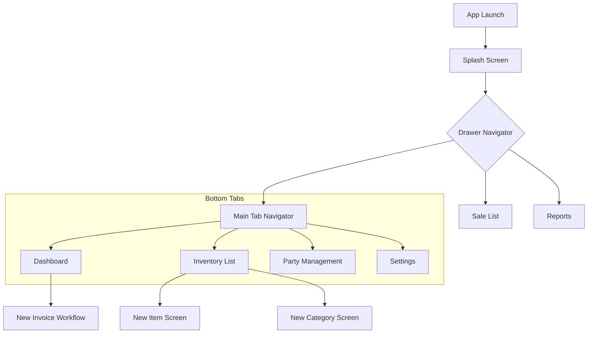

# EasyBill - Project Overview

EasyBill is a professional billing and inventory management application built with React Native. It is designed to help small to medium-sized businesses manage their sales, track inventory, and generate invoices efficiently.

## 🚀 Technology Stack

- **Framework**: [React Native](https://reactnative.dev/) (v0.82.1)
- **Language**: [TypeScript](https://www.typescriptlang.org/)
- **Styling**: [NativeWind](https://www.nativewind.dev/) (Tailwind CSS for React Native)
- **Navigation**: [React Navigation](https://reactnavigation.org/) (Stack, Drawer, and Bottom Tabs)
- **Icons**: [Lucide React Native](https://lucide.dev/)
- **Animations**: [React Native Reanimated](https://docs.swmansion.com/react-native-reanimated/)

## 📂 Project Structure

```text
EasyBill/
├── src/
│   ├── components/         # Reusable UI components
│   ├── navigation/         # Navigation configuration (Drawer, Tab, Root)
│   ├── screens/            # Application screens
│   │   ├── Dashboard/      # Dashboard related screens/components
│   │   └── settings/       # Settings related screens
│   ├── Inventory/          # Inventory management logic and screens
│   └── Drawer/             # Custom Drawer components
├── android/                # Android native project files
├── ios/                    # iOS native project files
├── App.tsx                 # Entry point component
├── index.js                # Registering the main component
└── tailwind.config.js      # NativeWind configuration
```

## ✨ Key Features

### 1. Dashboard
- **Real-time Metrics**: View daily sales, online/offline payments, and pending dues at a glance.
- **Recent Transactions**: Quick view of latest sales activity.
- **Quick Actions**: "New Invoice" and "Close Register" buttons for frequent tasks.
- **Thermal Printer Integration**: Support for connecting to thermal printers for instant receipt printing.

### 2. Inventory Management
- **Product Listing**: Comprehensive list of all items in stock.
- **Item Creation**: Add new items with details like category, price, and stock levels.
- **Categorization**: Group items into categories for better organization.

### 3. Billing & Invoices
- **Invoice Generation**: Create professional invoices for customers.
- **Payment Methods**: Support for Cash, UPI/Bank, and Cheque.

### 4. Party Management
- **Customer/Vendor Tracking**: Manage information for different parties involved in transactions.

### 5. Navigation & UI
- **Modern UI**: Clean, professional design using NativeWind and custom themes.
- **Intuitive Navigation**: Seamless transitions between Dashboard, Inventory, and Settings using Drawer and Bottom Tab navigators.

## 🔄 Project Flow

The application follows a structured navigation flow to ensure ease of use and quick access to core billing features.

### Navigation Architecture
1.  **Splash Screen**: Initial loading and branding.
2.  **Drawer Navigator**: Global access to main modules (Dashboard, Sales, Reports).
3.  **Tab Navigator**: Quick switching between primary screens (Dashboard, Inventory, Parties, Settings).
4.  **Action Screens**: Specific workflows like creating new items or categories.

### 🗺️ Flow Chart



## 🛠️ Getting Started

### Prerequisites
- Node.js (>= 20)
- React Native development environment set up (Android Studio / Xcode)

### Installation
1. Clone the repository
2. Install dependencies: `npm install`
3. For iOS: `cd ios && pod install`

### Running the App
- **Android**: `npm run android`
- **iOS**: `npm run ios`
- **Start Metro**: `npm start`

---
*Updated on 2026-05-02*
